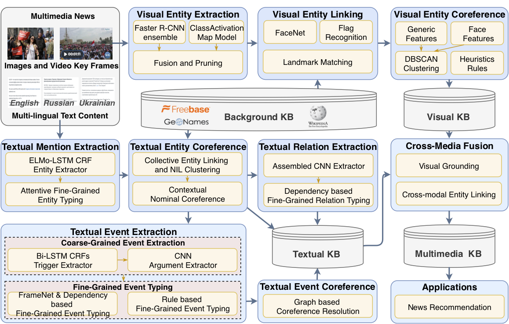

# GAIA: A Cross-media Fine-grained Knowledge Extraction System

This is the code for [GAIA: A Cross-media Fine-grained Knowledge Extraction System](http://blender.cs.illinois.edu/software/gaia-ie/) ([Paper](https://blender.cs.illinois.edu/paper/aidaacl2020demo.pdf)). 

Table of Contents
=================
  * [Overview](#overview)
  * [Requirements](#requirements)
  * [Quickstart](#quickstart)

## Overview
<p align="center">
  
</p>

## Requirements

- Docker

## Resources

### Dockerhub Repositories
https://hub.docker.com/u/gaiaaida

### Github Repositories

- Text Pipeline
https://github.com/GAIA-AIDA/uiuc_ie_pipeline_fine_grained

- Object Detection
https://github.com/GAIA-AIDA/object-detection

- Face & Building Identification
https://github.com/GAIA-AIDA/face-building

- Grounding & Merging
https://github.com/GAIA-AIDA/grounding-merging

## Quickstart

### UIUC Text IE Pipeline
- Task: Entity Extraction, Relation Extraction, Event Extraction
- Source: https://github.com/GAIA-AIDA/uiuc_ie_pipeline_fine_grained
- Input: (1) text data, including `ltf` and `rsd` source files. (2) `parent_child_tab` is a meta data file containing columns `child_uid` and `parent_uid` storing file name, content_date storing publication date, and example file is testdata_dryrun/parent_children.sorted.tab. (3) `en_asr_path`, `en_ocr_path` and `ru_ocr_path` are generated from ASR and OCR system using docker `gaiaaida/asr` from DockerHub. Example files are in `data/asr.english` and `data/video.ocr`.
- Output: 
   - extraction result in cold start format
      - <output_dir>/en/en_full_link.cs
      - <output_dir>/ru/ru_full_link.cs
      - <output_dir>/uk/uk_full_link.cs
   - extraction result in AIF format
      - <output_dir>/kb/ttl
- Docker:
```
sh pipeline_sample_full.sh ${data_root_ltf} ${data_root_rsd} ${output_dir} ${parent_child_tab} ${en_asr_path} ${en_ocr_path} ${ru_ocr_path}
```
If you do not have parent_child_tab, en_asr_path, en_ocr_path and ru_ocr_path, please use None. Please find details in https://github.com/limanling/uiuc_ie_pipeline_fine_grained.

### Columbia University Vision Pipeline
- Task: Object Detection, Face/Flag/Landmark Recognition, Visual Grounding, Instance Matching, Multimodal Event Graph Merging (Vision and Text)
- Source: https://github.com/GAIA-AIDA/grounding-merging
- [Pipline Overview](https://github.com/GAIA-AIDA/grounding-merging/blob/master/README.md)
- [Data Download](https://drive.google.com/open?id=1JQak5s31I4nwGNASpOQ_GbQpJuS85lFr)
- Data Structure
```
columbia_data_root
├── columbia_vision_shared
│   ├── cu_objdet_results
│   ├── cu_grounding_matching_features
│   ├── cu_grounding_results
│   ├── uiuc_ttl_results
│   ├── uiuc_asr_files
│   ├── cu_grounding_dict_files
│   ├── cu_ttl_tmp
│   ├── cu_graph_merging_ttl
│   └── ...
├── columbia_object_detection_models
├── columbia_recognition_models
└── columbia_visual_grounding_models
```

### Object Detection
- Task: Object Detection
- Source: https://github.com/GAIA-AIDA/object-detection
- Dependencies: 
  * `path/to/columbia_data_root/columbia_object_detection_models/*`
- Input: 
  * `/path/to/ldc/corpus/data/jpg/jpg/*.jpg[.ldcc]`
  * `/path/to/ldc/corpus/data/video_shot_boundaries/representative_frames/*/*.png[.ldcc]`
  * `/path/to/ldc/corpus/docs/masterShotBoundary.msb`
  * `/path/to/ldc/corpus/docs/parent_children.sorted.tab`
- Output:
  * `/root/output/aida_output_34.pkl`
  * `/root/output/det_results_merged_34a.pkl`
  * `/root/output/det_results_merged_34b.pkl`

- Consumer: CU Face, Flag, Landmark Detection, CU Visual Grounding, and CU Visual Grounding Dictionaries

- To build and run the system:

```
$ INPUT=/path/to/ldc/corpus
$ OUTPUT=/path/to/output/directory
$ GPU_ID=[a single integer index to the GPU]

$ chmod +x ./full_script.sh
$ docker build . --tag [TAG]
$ CONTAINER_ID=`docker run -itd -v ${INPUT}:/root/input:ro -v ${OUTPUT}:/root/output \
                -e CUDA_VISIBLE_DEVICES=${GPU_ID} --gpus=${GPU_ID} --name aida-cu-od [TAG] /bin/bash`
$ docker exec -it ${CONTAINER_ID} /bin/bash

$ sh ./full_script.sh 
```

If `/path/to/columbia_data_root/columbia_vision_shared/aida_output_34.pkl` (and two other files) exists, it means the system has run successfully.

Optionally, you may mount `CORPUS`, `OUTPUT`, and/or `MODELS` on different paths, in which case you should pass the new paths to `docker run` using `-e CORPUS=/new/corpus/path`, etc.


### Face, Flag, Landmark Detection
- Task: Detection and recognition for face, flag, and landmark.
- Source: https://github.com/GAIA-AIDA/face-building
- Input: LDC2019E42 unpacked data, Columbia object detection, UIUC text output.
```
# Initialization
corpus_path = LDC2019E42
working_path = shared + 'cu_FFL_shared/'
model_path = models + 'cu_FFL_models/'
Lorelei = 'LDC2018E80_LORELEI_Background_KB/data/entities.tab'

# Input Paths
# Source corpus data paths
parent_child_tab = corpus_path + 'docs/parent_children.sorted.tab'
kfrm_msb = corpus_path + 'docs/masterShotBoundary.msb'
kfrm_ldcc = corpus_path + 'data/video_shot_boundaries/representative_frames/'
jpg_ldcc = corpus_path + 'data/jpg/jpg/' 
jpg_path = working_path + 'jpg/jpg/'
kfrm_path = working_path + 'video_shot_boundaries/representative_frames/'
ltf_path = corpus_path + 'data/ltf/ltf/'

#UIUC text mention result paths
txt_mention_ttl_path = working_path + 'uiuc_ttl_results/' + version_folder + uiuc_run_folder # 1/7th May

# CU object detection result paths
det_results_path_graph = working_path + 'cu_objdet_results/' + version_folder + 'aida_output_34.pkl'
det_results_path_img = working_path + 'cu_objdet_results/' + version_folder + 'det_results_merged_34a.pkl'
det_results_path_kfrm = working_path + 'cu_objdet_results/' + version_folder + 'det_results_merged_34b.pkl'

# Model Paths
face_model_path = model_path + 'models/'

# Face detection and recognition
face_det_jpg = working_path+'face_det_jpg'
face_det_kf = working_path+'face_det_kf'
face_class_jpg = working_path+'face_class_jpg'
face_class_kf = working_path+'face_class_kf'
obj_det_results = working_path+'obj_det'

bbox_jpg = working_path+'bbox_jpg'
bbox_kf = working_path+'bbox_kf'

#Flag
flag_det_results = working_path+'flag_det'
flag_class_results = working_path+'flag_m18_2'

#Landmark
landmark_results = working_path+'building_result'

#RPI_result
RPI_entity_out = working_path+'txt_mention_out'
```
- Output: CU object detection, CU Face, Flag, Landmark Detection ttl files
```
# Output Paths
out_ttl = working_path + 'cu_object_FFT_ttl/' 
```
- Consumer: To CU Graph Merging.
Docker

```
$ INPUT= /host_input/
$ OUTPUT=/host_output/
$ GPU_ID=[a single integer index to the GPU]

docker run --gpus 8 -it -v /dvmm-filer2/projects/AIDA/data/ldc_eval_m18/LDC2019E42_AIDA_Phase_1_Evaluation_Source_Data_V1.0:/aida/src/m18_data -v /dvmm-filer2/projects/AIDA/data/columbia_data_root:/aida/src/columbia_data_root -e CUDA_VISIBLE_DEVICES=${GPU_ID} brian271828/brian_aida:0511

docker run --gpus 8 -it -v /dvmm-filer2/projects/AIDA/data/ldc_eval_m18/LDC2019E42_AIDA_Phase_1_Evaluation_Source_Data_V1.0:/aida/src/m18_data -v /dvmm-filer2/projects/AIDA/data/columbia_data_root/columbia_vision_shared:/output -e CUDA_VISIBLE_DEVICES=0 brian271828/brian_aida:0701


$ chmod +x ./full_script.sh
$ docker build . --tag [TAG]
$ CONTAINER_ID=`docker run --gpus ${GPU_ID} -it -v ${INPUT}:/aida/src/m18_data -v ${OUTPUT}/WORKING/columbia_vision_shared:/output --name aida-cu-fd [TAG] /bin/bash`
$ docker exec -it ${CONTAINER_ID} /bin/bash

$ sh ./full_script.sh 

```

### Visual Grounding
- Task: Visual Grounding Results Generation
- Source: https://github.com/GAIA-AIDA/grounding-merging
- Running Details: Please find running instructions in https://github.com/GAIA-AIDA/grounding-merging

### Text and Visual IE Result Merging
- Task: Final merge
- Details here: https://github.com/isi-vista/aida-tools#cleaning-kbs-cleankb-jvm
- Input: (1) merged KB from `CU Graph Merging` 
- Output: final ttl
```
## construct params files
echo "parentChildMapFilenames: /aida-tools-master/sample_params/m18-eval/"${parent_child_tab_path} > ${data_root_result}/uiuc_clean_normal_params
echo "masterShotTable: /aida-tools-master/sample_params/m18-eval/"${masterShotTable_path} >> ${data_root_result}/uiuc_clean_normal_params
echo "sourceDir: /aida-tools-master/sample_params/m18-eval/"${preprocessed_source_dir_from_uiuc} >> ${data_root_result}/uiuc_clean_normal_params
echo "sampledOcrDir: /aida-tools-master/sample_params/m18-eval/"${ocr_path_from_OCR} >> ${data_root_result}/uiuc_clean_normal_params
echo "INCLUDE m18_cleaning.common.params" >> ${data_root_result}/uiuc_clean_normal_params
echo "kbsToRead: /aida-tools-master/sample_params/m18-eval/"${all_merged_ttl} >> ${data_root_result}/uiuc_clean_normal_params
echo "baseOutputDir: /aida-tools-master/sample_params/m18-eval/"${final_ttl} >> ${data_root_result}/uiuc_clean_normal_params
echo "variantNum: 1" >> ${data_root_result}/uiuc_clean_normal_params
echo "suppressValidation: true" >> ${data_root_result}/uiuc_clean_normal_params
## run docker
docker run --rm -v ${PWD}:/aida-tools-master/sample_params/m18-eval -w /aida-tools-master -i -t limanling/aida-tools \
    /aida-tools-master/aida-eval-tools/target/appassembler/bin/cleanKB  \
    sample_params/m18-eval/${data_root_result}/uiuc_clean_normal_params
```
